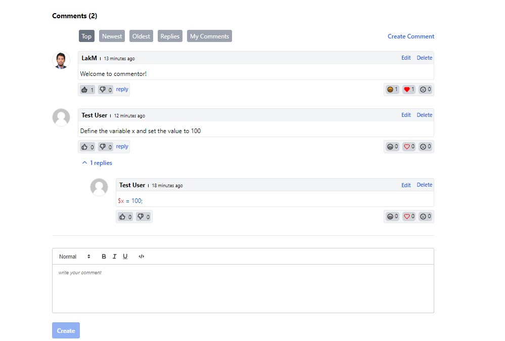

# 😍 Commenter

<figure><figcaption></figcaption></figure>

<figure><figcaption></figcaption></figure>

 

<figure><figcaption></figcaption></figure>

 

<figure><figcaption></figcaption></figure>

## Overview

Commenter is a feature-rich, modern package with an admin panel designed to address all your commenting needs. With this package, you won't need any additional tools for the comment functionality in your Laravel projects.

<figure><figcaption></figcaption></figure>

## Quick links


[why-commentor.md](overview/why-commentor.md)



[key-features.md](overview/key-features.md)

