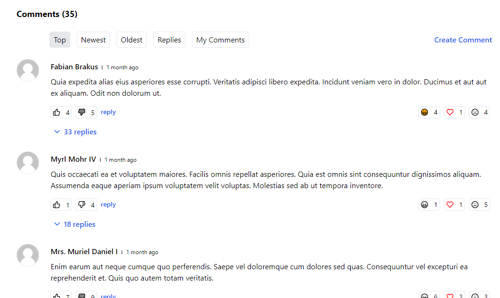
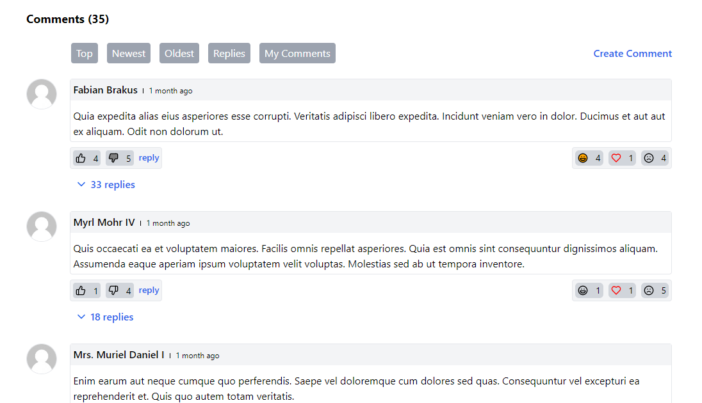

---
layout:
  title:
    visible: true
  description:
    visible: false
  tableOfContents:
    visible: true
  outline:
    visible: true
  pagination:
    visible: true
---

# 🌈 Themes

Package provides 3 themes currently.

* default - classic theme&#x20;
* github - github style&#x20;
* modern - Elegant interfaces designed to align with modern aesthetics.

You can change the theme using `theme` key in the config file.

```php
// commenter.php

return [
     /**
     * Available themes default,github,modern
     */
    'theme' => 'default',
]
```

### Changing Colors

Most of the time, all you need is to adjust the colors of your commenting system to match your site's design. You can easily do this by updating the relevant keys in the configuration files. For advanced configurations, please refer to the [customization section](../advance/customization.md).

<figure><figcaption></figcaption></figure>

```php
// comments.php

return [
    'primary_color' => 'green',

    'secondary_color' => '#000000',

    'bg_primary_color' => '#ededed',

    'bg_secondary_color' => 'white',

    'active_color' => 'rgb(209,213,219)',

    'hover_color' => 'rgb(229,231,235)',

    'button_color' => '#0000FF',

    'button_hover_color' => '#0707a5',

]
```

### Default

<figure><figcaption></figcaption></figure>

### GitHub

<figure><figcaption></figcaption></figure>

### Modern

<figure><figcaption></figcaption></figure>
