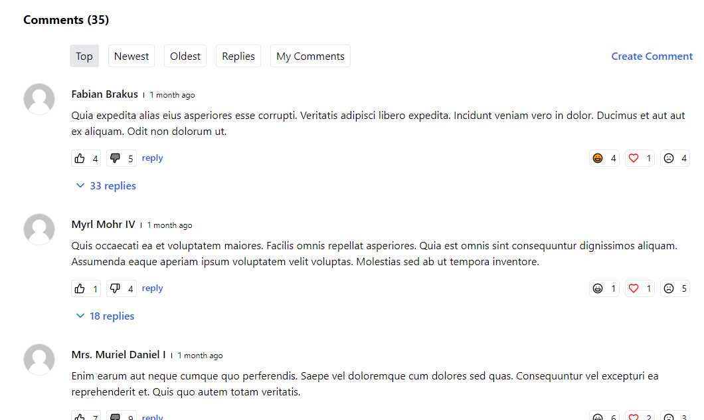
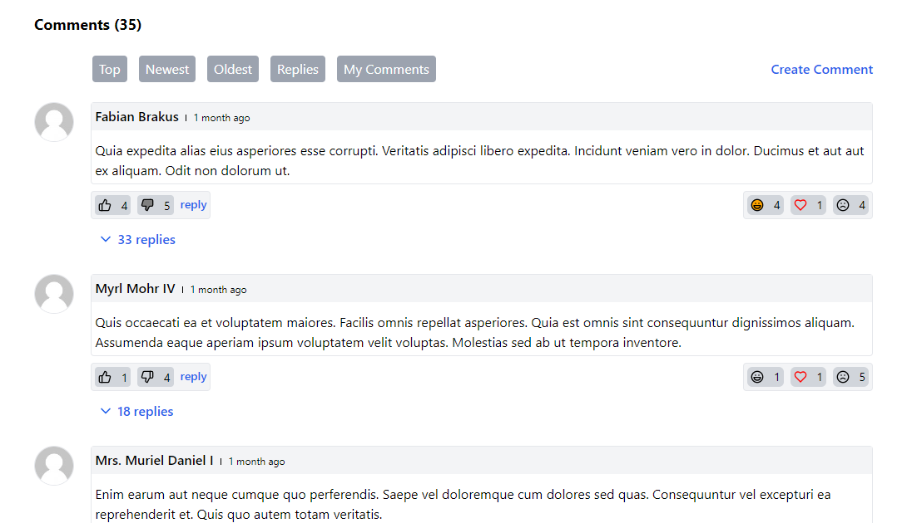

---
layout:
  title:
    visible: true
  description:
    visible: false
  tableOfContents:
    visible: true
  outline:
    visible: true
  pagination:
    visible: true
---

# 🌈 Themes

### Package uses simple them by default.

You can change the theme using `theme` key in the config file.

```php
// comments.php

return [
     /**
     * Available themes default,github
     */
    'theme' => 'default',
]
```

### Video Tutorial

{% embed url="https://private-user-images.githubusercontent.com/47297673/356509358-33d45497-e5a3-4371-92a6-c69c6210909c.mp4?jwt=eyJhbGciOiJIUzI1NiIsInR5cCI6IkpXVCJ9.eyJpc3MiOiJnaXRodWIuY29tIiwiYXVkIjoicmF3LmdpdGh1YnVzZXJjb250ZW50LmNvbSIsImtleSI6ImtleTUiLCJleHAiOjE3MjMxOTAyOTgsIm5iZiI6MTcyMzE4OTk5OCwicGF0aCI6Ii80NzI5NzY3My8zNTY1MDkzNTgtMzNkNDU0OTctZTVhMy00MzcxLTkyYTYtYzY5YzYyMTA5MDljLm1wND9YLUFtei1BbGdvcml0aG09QVdTNC1ITUFDLVNIQTI1NiZYLUFtei1DcmVkZW50aWFsPUFLSUFWQ09EWUxTQTUzUFFLNFpBJTJGMjAyNDA4MDklMkZ1cy1lYXN0LTElMkZzMyUyRmF3czRfcmVxdWVzdCZYLUFtei1EYXRlPTIwMjQwODA5VDA3NTMxOFomWC1BbXotRXhwaXJlcz0zMDAmWC1BbXotU2lnbmF0dXJlPTNhMzk5NTNhMDk3YjYxMTc1MDM2NWE5NTk4YzJjNWY0NTkxMzVlODI0MmZkODIzZTA0NzRhZTFkYmU0NTAyMzEmWC1BbXotU2lnbmVkSGVhZGVycz1ob3N0JmFjdG9yX2lkPTAma2V5X2lkPTAmcmVwb19pZD0wIn0.6rxcsKLXmYSjgIUjdLc9xBmxnc6Pi7sjs6SvvYKJPCk" %}

### Available Themes

#### Default

<figure><figcaption></figcaption></figure>

#### GitHub

<figure><figcaption></figcaption></figure>
